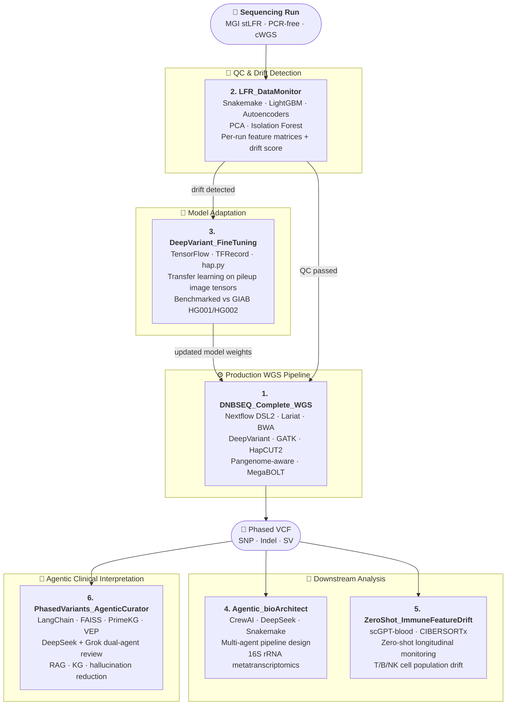

# Applied ML & Agentic AI in Biomedical Genomics

**Portfolio for Biotech Machine Learning Engineer roles**

End-to-end ML engineering across production genomics pipelines, foundation model fine-tuning, agentic AI orchestration, and real-time data drift monitoring — all applied to sequencing data at scale.

---

## Projects

### 1. [DNBSEQ Complete WGS Pipeline](https://github.com/Complete-Genomics/DNBSEQ_Complete_WGS)
> Production-grade WGS pipeline integrating two library chemistries (PCR-free + DNB-barcoded cWGS) into phased, high-accuracy variant calls.

- **Stack**: Nextflow DSL2 · Lariat · BWA · DeepVariant · GATK · HapCUT2 · SOAPnuke · MegaBOLT · Singularity
- **Scale**: Parallel real-world human sequencing data 
- **Highlights**: Pangenome-aware DeepVariant (GBZ graph reference), phased SNP/indel/SV calls, modular process design with configurable variant callers and aligners

---

### 2. [LFR Data Monitor — Sequencing QC & Drift Detection](https://github.com/arcadianlyric/LFR_DataMonitor)
> ML-powered QC monitor for MGI stLFR/cLFR co-barcoding runs; detects data drift that degrades downstream variant-calling model performance.

- **Stack**: Snakemake · BWA · DeepVariant · LightGBM · Autoencoders · PCA · Isolation Forest
- **Highlights**: Per-run feature matrices from alignment + variant metrics; unsupervised drift detection; automated fine-tuning trigger when distribution shift exceeds threshold

---

### 3. [Google DeepVariant Fine-Tuning](https://github.com/arcadianlyric/GoogleDeepVariant_FineTuning)
> Adapts pretrained DeepVariant (Inception-v3 CNN) to shifted sequencing distributions — reducing detection-to-retraining cycle from days to hours.

- **Stack**: TensorFlow/Keras · TFRecord · hap.py · GIAB truth sets · Google Colab
- **Highlights**: Transfer learning on pileup image tensors; benchmarked against GIAB HG001/HG002; integrates upstream drift signals from LFR_DataMonitor for automated adaptation without training from scratch

---

### 4. [Agentic bioArchitect — Multi-Agent Pipeline Design](https://github.com/arcadianlyric/Agentic_bioArchitect)
> Multi-agent LLM system that designs and implements bioinformatics pipelines for 16S rRNA metatranscriptomics with UMI support, eliminating PCR amplification bias.

- **Stack**: CrewAI · OpenAI / DeepSeek / Gemini / Grok · Tavily · PubMed API · MEGAHIT · DADA2 · Snakemake
- **Highlights**: Phase 1 — research + reviewer agents produce validated workflow designs; Phase 2 — coder agents generate production Python/Snakemake; benchmarked against ZymoBIOMICS community standards

---

### 5. [ZeroShot Immune Feature Drift](https://github.com/arcadianlyric/ZeroShot_ImmuneFeatureDrift)
> Zero-shot foundation model monitoring of immune aging (immunosenescence) across longitudinal bulk RNA-seq without fine-tuning on small datasets.

- **Stack**: scGPT-blood (12-layer Transformer, 10.3 M cells pre-training) · CIBERSORTx · Isolation Forest · PCA · stLFR sequencing
- **Highlights**: Tracks T-cell, B-cell, monocyte, NK cell shifts across 3 PBMC timepoints (2024–2026); identifies isoform switches in aging markers (PTPRC/CD45); cosine + Euclidean embedding drift metrics

---

### 6. [PhasedVariants AgenticCurator](https://github.com/arcadianlyric/PhasedVariants_AgenticCurator)
> Multi-agent LLM system with RAG and knowledge graph integration that automates interpretation of phased WGS variants — linking haplotype-resolved genotypes to gene function, disease mechanisms, and clinical significance.

- **Stack**: LangChain · FAISS · DeepSeek · Grok (xAI) · PrimeKG · VEP · PubMed / GeneCards / arXiv / Tavily · sentence-transformers · ClinVar
- **Highlights**:
  - **3-stage pipeline**: VEP-annotated phased VCF → interactive gene-disease-pathway network (PrimeKG) → multi-source literature retrieval (progressive search across 4 APIs) → agentic curation with quality-controlled output
  - **Dual-agent review loop**: Output Agent (DeepSeek, RAG + KG context) generates analysis; Review Agent (Grok) independently scores 5 dimensions (0–10) and flags hallucinations; loop iterates until quality threshold (7.0/10) is met. Different LLMs used by design to eliminate shared blind spots
  - **Hallucination reduction**: Cross-model review + FAISS-grounded retrieval; benchmarked against single-agent baselines (`llm_queryAlone`, `llm_augmented`, `llm_rag`, v1 7-agent legacy)
  - Directly consumes phased VCF output from Project 1 (DNBSEQ_Complete_WGS)

---

## Competency Map

| Domain | Skills |
|---|---|
| **Genomics pipelines** | WGS · variant calling · phasing · SV · QC · Nextflow · Snakemake |
| **ML / DL** | CNN fine-tuning · transfer learning · LightGBM · autoencoders · foundation models |
| **Drift & monitoring** | Unsupervised drift detection · Isolation Forest · PCA · embedding similarity |
| **Agentic AI** | Multi-agent orchestration (CrewAI / LangChain) · RAG · FAISS · knowledge graphs · hallucination reduction |
| **MLOps** | TFX · TFRecord · Docker · Singularity · automated retraining triggers |
| **Languages & tools** | Python · Groovy · R · Bash · TensorFlow · PyTorch · HuggingFace |

---

## Architecture: Integrated Workflow

The six projects form a coherent ML system: a production pipeline (1) fed by monitored, drift-corrected models (2, 3), extended by agentic automation (4), foundation model analytics (5), and closed by automated clinical interpretation of the phased variants produced in step 1 (6).